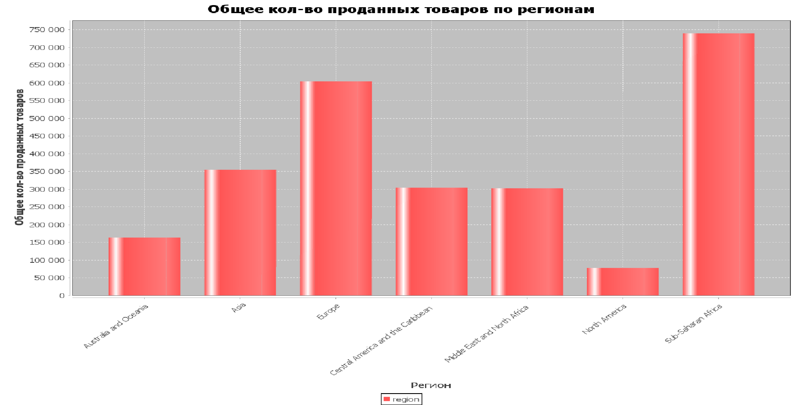

Проект по Java вар 6

Продажа продуктов в мире

1 Постройте график по общему количеству проданных товаров,
объединив их по регионам

2 Выведите в консоль страну с самым высоким 
общим доходом среди регионов Европы и Азии

3 Найдите страну, у которой общий доход от 420 тыс. до 440 тыс.,
среди регионов Ближний Восток и Северная Африка(Middle East and North Africa)
и СубСахарская Африка(Sub-Saharan Africa), с самым высоким общим доходом.

Первым делом создаем класс Sale\
Затем класс Parser, в котором будет реализован парсинг csv файла\
Далее создаем класс Database, в котором реализуем создание БД и работу с ней, создание таблиц, их заполнение, а также пропишем запросы к таблице, полученной из даннных в файле\
Потом создаем класс Info, методы которого будут выводить результаты запроса\
В конце создаем класс Diagramm, который создает диаграмму и "заполняет" ее данными из map\
В Main инициализируем БД , выводим результаты запросов и выводим диаграмму

Диаграмма

Запрос к зад. 2

Запрос к зад.3

Вывод запросов:

